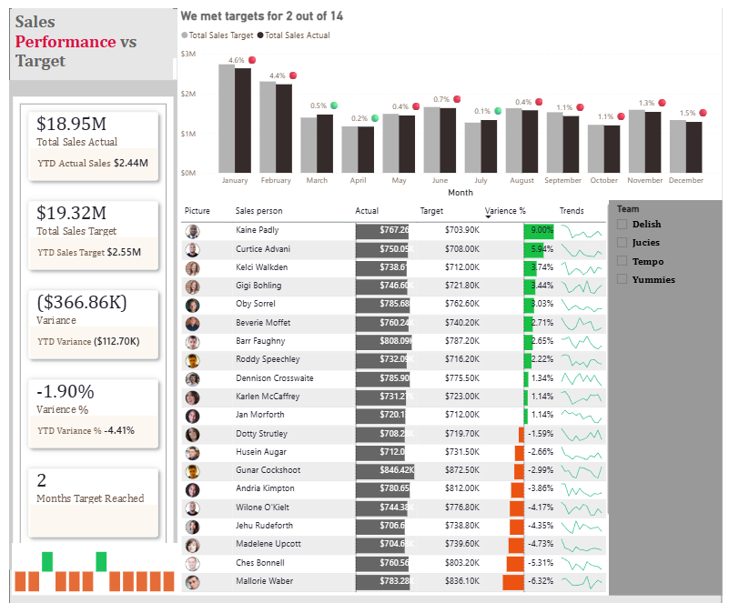
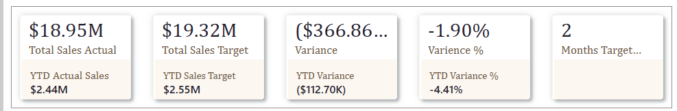
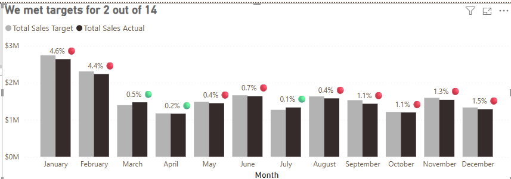
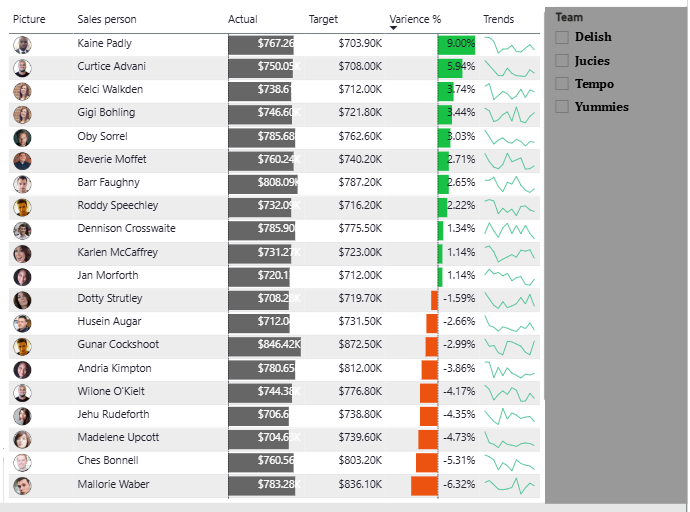

# 📊 Sales Performance Dashboard - Power BI Analytics


> An interactive Power BI dashboard analyzing Year-to-Date (YTD) sales performance against targets, featuring comprehensive KPI tracking, trend analysis, and salesperson performance metrics.

---

## 📋 Table of Contents

- [Overview](#overview)
- [Dashboard Preview](#dashboard-preview)
- [Key Features](#key-features)
- [Business Questions Answered](#business-questions-answered)
- [Data Model](#data-model)
- [DAX Measures](#dax-measures)
- [Key Insights](#key-insights)
- [Installation & Setup](#installation--setup)
- [Project Structure](#project-structure)
- [Technologies Used](#technologies-used)
- [Contributing](#contributing)
- [License](#license)
- [Contact](#contact)

---

## 🎯 Overview

This project presents a comprehensive **Sales Performance Dashboard** built in Power BI to monitor and analyze sales team performance against established targets. The dashboard provides real-time insights into:

- YTD sales performance vs. targets
- Monthly trend analysis
- Individual salesperson performance
- Variance tracking and KPI monitoring
- Team-based performance segmentation

**Project Type:** Business Intelligence | Data Analytics | Sales Performance Management

**Tools Used:** Microsoft Power BI Desktop, Excel, DAX

---

## 📸 Dashboard Preview

### Full Dashboard Overview

*Complete view of the sales performance dashboard showing KPIs, trends, and salesperson analysis*

### Key Performance Indicators (KPIs)

*YTD metrics including Total Sales Actual ($18.95M), Target ($19.32M), Variance (-$366.86K), and achievement rate*

### Monthly Performance Trend

*Month-over-month sales performance showing targets met in 2 out of 14 months*

### Salesperson Performance Analysis

*Individual performance breakdown with variance percentages and trend indicators*

---

## ✨ Key Features

### 📈 Interactive Visualizations
- **KPI Cards**: Real-time display of critical metrics (YTD Actual, Target, Variance, Variance %)
- **Column Charts**: Monthly comparison of actual vs. target sales with variance indicators
- **Performance Table**: Detailed salesperson-level analysis with conditional formatting
- **Trend Sparklines**: Visual representation of individual performance trajectories

### 🎛️ Dynamic Filtering
- **Team Filter**: Segment analysis by sales teams (Dalish, Jucies, Tempo, Yummies)
- **Date Range Selector**: Flexible time period analysis
- **Drill-through Capabilities**: Deep-dive into specific periods or salespeople

### 📊 Advanced Analytics
- **Year-to-Date (YTD) Calculations**: Cumulative performance tracking
- **Variance Analysis**: Absolute and percentage-based variance metrics
- **Target Achievement Tracking**: Count of months where targets were successfully met
- **Trend Analysis**: Month-over-month performance comparison

---

## 💡 Business Questions Answered

This dashboard provides data-driven answers to critical business questions:

1. **Are we meeting our sales targets?**
   - Current Status: YTD Actual at $18.95M vs. Target of $19.32M (-1.90% variance)

2. **Which months performed well or poorly?**
   - Targets met in only 2 out of 14 months (January and February)
   - Consistent underperformance from March onwards

3. **Who are the top and bottom performers?**
   - **Top Performer**: Kaine Paddy (+40% above target)
   - **Bottom Performer**: Mallorie Weber (-6.32% below target)

4. **What are the performance trends?**
   - Declining trend beginning in March 2024, persisting for 10 consecutive months

5. **What is our target achievement rate?**
   - Only 14.3% of months achieved targets, indicating systemic challenges

---

## 🗄️ Data Model

### Data Sources

The dashboard integrates three primary data sources:

#### 1. **Actual Sales Data**
- **Source**: CRM/Sales System
- **Granularity**: Salesperson x Month
- **Key Fields**: 
  - Salesperson Name
  - Sales Amount
  - Date
  - Team

#### 2. **Target Sales Data**
- **Source**: Management Planning System
- **Granularity**: Salesperson x Month
- **Key Fields**:
  - Salesperson Name
  - Target Amount
  - Date Period

#### 3. **Calendar Table**
- **Type**: Dimension Table (Date Intelligence)
- **Key Fields**:
  - Date
  - Year
  - Month
  - Quarter
  - YearMonth
  - MonthName

### Relationships

```
Calendar[Date] ──1:* Actual[Date]
Calendar[Date] ──1:* Targets[Date]
Salesperson[ID] ──1:* Actual[SalespersonID]
Salesperson[ID] ──1:* Targets[SalespersonID]
```

---

## 🧮 DAX Measures

### Base Measures

```dax
Total Sales Actual = 
SUM(Actual[Sales])
```

```dax
Total Sales Target = 
SUM(Targets[Sales])
```

### Variance Measures

```dax
Variance = 
[Total Sales Actual] - [Total Sales Target]
```

```dax
Variance % = 
DIVIDE([Variance], [Total Sales Target])
```

### YTD Measures

```dax
YTD Actual Sales = 
CALCULATE(
    [Total Sales Actual],
    DATESYTD('Calendar'[Date])
)
```

```dax
YTD Sales Target = 
CALCULATE(
    [Total Sales Target],
    DATESYTD('Calendar'[Date])
)
```

```dax
YTD Variance = 
[YTD Actual Sales] - [YTD Sales Target]
```

```dax
YTD Variance % = 
DIVIDE(
    [YTD Variance],
    [YTD Sales Target]
)
```

### Target Achievement Tracking

```dax
Target Status = 
SWITCH(
    TRUE(),
    ISBLANK([Variance]), BLANK(),
    [Variance] > 0, 1,
    0
)
```

```dax
Months Target Reached = 
COUNTROWS(
    FILTER(
        VALUES('Calendar'[YearMonth]),
        CALCULATE([Variance]) > 0
    )
)
```

### Trend Analysis

```dax
Actual Trend % = 
VAR CurrentValue = [Total Sales Actual]
VAR PreviousValue = 
    CALCULATE(
        [Total Sales Actual],
        DATEADD('Calendar'[Date], -1, MONTH)
    )
RETURN
DIVIDE(CurrentValue - PreviousValue, PreviousValue)
```

```dax
Target Trend % = 
VAR CurrentValue = [Total Sales Target]
VAR PreviousValue = 
    CALCULATE(
        [Total Sales Target],
        DATEADD('Calendar'[Date], -1, MONTH)
    )
RETURN
DIVIDE(CurrentValue - PreviousValue, PreviousValue)
```

**📄 Complete DAX documentation available in:** [`powerbi/dax-formulas.md`](powerbi/dax-formulas.md)

---

## 📊 Key Insights

### Performance Summary

| Metric | Value | Status |
|--------|-------|--------|
| **YTD Actual Sales** | $18.95M | 🔴 Below Target |
| **YTD Target Sales** | $19.32M | - |
| **YTD Variance** | -$366.86K | 🔴 -1.90% |
| **Months Target Reached** | 2 / 14 | 🔴 14.3% |

### Critical Findings

1. **📉 Sustained Decline**: Performance deterioration began in March 2024 and persisted for 10 consecutive months

2. **👥 Concentrated Underperformance**: Bottom 4 salespeople contribute disproportionately to overall negative variance

3. **⚠️ Low Achievement Rate**: Only 14.3% of months met targets, indicating systemic execution challenges

4. **📈 Top Performer Insight**: Kaine Paddy exceeds target by 40%, suggesting replicable best practices

### Recommendations

- **Immediate**: Conduct performance reviews for bottom quartile performers
- **Short-term**: Implement peer mentorship pairing top and struggling performers
- **Medium-term**: Validate target realism and adjust compensation structures
- **Ongoing**: Weekly dashboard reviews to track recovery progress

**📄 Detailed analysis available in:** [`docs/Sales_Performance_Report.docx`](docs/Sales_Performance_Report.docx)

---

## 🚀 Installation & Setup

### Prerequisites

- **Microsoft Power BI Desktop** (latest version)
  - Download: [Power BI Desktop](https://powerbi.microsoft.com/desktop/)
- **Microsoft Excel** (2016 or later) - for viewing dataset

### Steps to Use This Dashboard

1. **Clone the Repository**
   ```bash
   git clone https://github.com/yourusername/sales-performance-dashboard.git
   cd sales-performance-dashboard
   ```

2. **Open the Dataset**
   ```bash
   # Navigate to data folder
   cd data
   # Open the Excel file to review the data structure
   ```

3. **Open Power BI File**
   - Navigate to `powerbi/` folder
   - Double-click `Sales-Performance-Dashboard.pbix`
   - Power BI Desktop will open the dashboard

4. **Refresh Data** (if needed)
   - Click **Home** → **Refresh**
   - Ensure data source paths are correctly configured

5. **Explore the Dashboard**
   - Use slicers to filter by team, date range
   - Click on visualizations to cross-filter
   - Review individual salesperson performance

### Data Refresh Instructions

If you want to use your own data:

1. Prepare your Excel file with three sheets:
   - `Actual` (Salesperson, Date, Sales)
   - `Targets` (Salesperson, Date, Target)
   - `Calendar` (Date, Year, Month, Quarter)

2. In Power BI:
   - Go to **Home** → **Transform Data** → **Data Source Settings**
   - Update the file path to your Excel file
   - Click **Refresh**

---

## 📁 Project Structure

```
sales-performance-dashboard/
│
├── README.md                                    # This file
├── LICENSE                                      # Project license
├── .gitignore                                   # Git ignore rules
│
├── data/                                        # Dataset folder
│   ├── actual-vs-target-dataset.xlsx           # Main Excel dataset
│   └── data-dictionary.md                      # Data field descriptions
│
├── powerbi/                                     # Power BI files
│   ├── Sales-Performance-Dashboard.pbix        # Main dashboard file
│   └── dax-formulas.md                         # All DAX measures documented
│
├── docs/                                        # Documentation
│   ├── Sales_Performance_Report.docx           # Detailed analysis report
│   ├── project-overview.md                     # Methodology & approach
│   └── insights-and-recommendations.md         # Business insights
│
├── screenshots/                                 # Dashboard images
│   ├── dashboard-overview.png                  # Full dashboard
│   ├── kpi-cards.png                          # KPI section
│   ├── monthly-trend.png                      # Trend chart
│   └── salesperson-table.png                  # Performance table
│
└── scripts/                                     # Optional scripts
    └── data-preparation.md                     # Data prep documentation
```

---

## 🛠️ Technologies Used

| Technology | Purpose |
|------------|---------|
| **Microsoft Power BI** | Data visualization and dashboard creation |
| **DAX (Data Analysis Expressions)** | Calculated measures and KPIs |
| **Power Query (M Language)** | Data transformation and cleaning |
| **Microsoft Excel** | Data storage and source files |
| **Git & GitHub** | Version control and collaboration |

### Power BI Features Utilized

- ✅ Interactive visualizations (Column charts, KPI cards, Tables)
- ✅ DAX measures for advanced calculations
- ✅ Time intelligence functions (YTD, MoM)
- ✅ Conditional formatting
- ✅ Slicers and filters
- ✅ Cross-filtering and drill-through
- ✅ Custom tooltips

---

## 🎓 Learning Outcomes

This project demonstrates proficiency in:

1. **Business Intelligence Development**
   - Dashboard design principles
   - KPI identification and tracking
   - User experience optimization

2. **Data Modeling**
   - Star schema design
   - Relationship management
   - Calendar table creation

3. **DAX Programming**
   - Time intelligence functions
   - Iterative calculations
   - Context manipulation

4. **Data Analysis**
   - Variance analysis
   - Trend identification
   - Performance benchmarking

5. **Business Acumen**
   - Translating business requirements to technical solutions
   - Identifying actionable insights
   - Recommending data-driven strategies

---

## 🤝 Contributing

Contributions, issues, and feature requests are welcome!

### How to Contribute

1. Fork the repository
2. Create your feature branch (`git checkout -b feature/AmazingFeature`)
3. Commit your changes (`git commit -m 'Add some AmazingFeature'`)
4. Push to the branch (`git push origin feature/AmazingFeature`)
5. Open a Pull Request

### Ideas for Contributions

- Add forecasting capabilities
- Implement anomaly detection
- Create mobile-optimized version
- Add additional KPIs (pipeline metrics, win rate, etc.)
- Integrate with real-time data sources

---

## 📜 License

This project is licensed under the **MIT License** - see the [LICENSE](LICENSE) file for details.

---

## 📧 Contact

**Your Name**
- GitHub: [@yourusername](https://github.com/yourusername)
- LinkedIn: [Your LinkedIn](https://linkedin.com/in/yourprofile)
- Email: your.email@example.com

**Project Link:** [https://github.com/yourusername/sales-performance-dashboard](https://github.com/yourusername/sales-performance-dashboard)

---

## 🙏 Acknowledgments

- Dashboard design inspired by industry best practices in sales analytics
- Data visualization principles from Stephen Few and Edward Tufte
- Power BI community for DAX optimization techniques

---

## 📈 Project Status


---

### ⭐ If you found this project helpful, please consider giving it a star!

---

## 📚 Additional Resources

- [Power BI Documentation](https://docs.microsoft.com/en-us/power-bi/)
- [DAX Guide](https://dax.guide/)
- [SQLBI - DAX Patterns](https://www.daxpatterns.com/)
- [Power BI Community](https://community.powerbi.com/)

---

**Built with ❤️ using Power BI**
